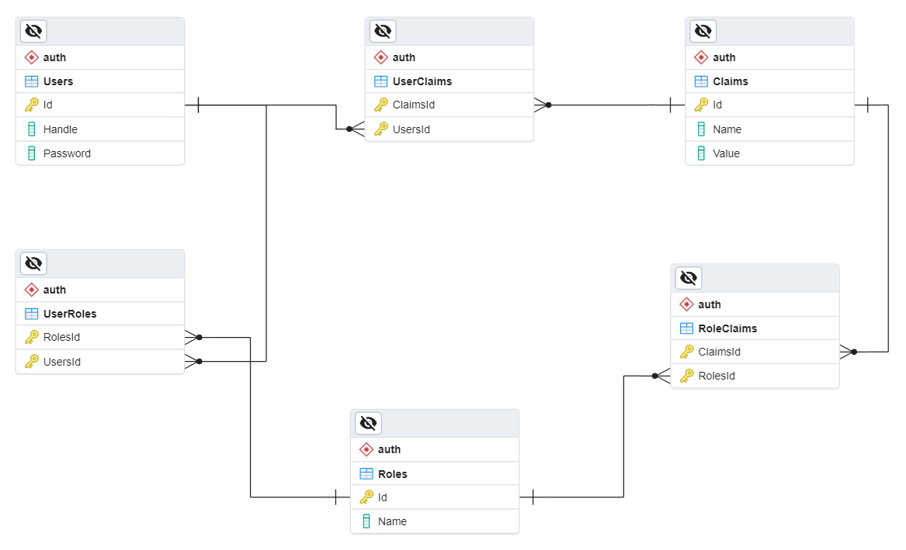

# AuthModule

 AuthModule provides support for JWT/cookie authentication and creates and manages the user database for your web api. all with two function calls and a little configuration.

## How to use

1. you will only need to define your User Model, and the DTO that will be used for registering/signing up a new user, and some configuration to get what you need.

- the user model needs to implement the `IUser` interface which is a generic interface that needs our user type, and the type of it's Id (primary key).

- and the DTO must implement the `IUserDto` interface.

assuming this is our user model:

``` c#
public class User : IUser<User, int>
{
    public int Id { get; set; }
    public string Handle { get; set; }
    public string Password { get; set; }
    public List<Claim<User>> Claims { get; set; } = new();
    public List<Role<User>> Roles { get ; set ; } = new();
}
```

and this is our user DTO:

``` c#
public class UserDTO : IUserDto
{
    public string Handle { get; set; }
    public string Password { get; set; }
}
```

> Note: *interfaces by definition don't have fields, so the properties in it are only getter/setter functions that you must implement, which means you can have whatever properties you want with whatever names you want and implement the get/set functions of the interface properties to get/set your property.*

2. now we for the next step, we need to construct the [`AuthSettings`](#authsettings) object to declare how we want our authentication.

```c#
var authSettings = new AuthSettings<User, int>
{
    ConfigureDbOptions = (options) => 
    options.UseNpgsql(builder.Configuration.GetConnectionString("Default")),
    
    JwtTokenSettings = new()
    {
        SecurityAlgorithm = SecurityAlgorithms.HmacSha256,
        Expiration = TimeSpan.FromHours(1),
        ConfigOptions = (o) =>
        {
            o.TokenValidationParameters = new()
            {
                ValidateIssuerSigningKey = true,

                ValidIssuer = builder.Configuration["JWT:Issuer"],
                ValidAudience = builder.Configuration["JWT:Audience"],
                IssuerSigningKey = 
                new SymmetricSecurityKey(Encoding.UTF8.GetBytes(builder.Configuration["JWT:Key"]!)),
            };
        }
    }
};

authSettings
    .AddUserInfoClaim(nameof(User.Id))
    .AddUserInfoClaim(nameof(User.Handle));

```

> this declartion of the object states that a PostgreSQL database will be used with the connection string declared in the configuration "ConnectionStrings" sction, the authentication will be jwt authentication with the settings provided in the "JWT" configuration section, and the generated token on signing in will contain the id of the user and his handle (username) in it's payload (claims)

3. now in our Program.cs we need to call `AddAuthModule` to register AuthModule services

``` c#  
builder.Services.AddAuthModule<User, UserDTO, int>(authSettings);
```

> this generic extension method takes the user model type as `TUser`, which in our case is the `User` class defined previously, the user dto as `TUserRegistrationDto`, which in our case is `UserDTO`, and the type of the user Id as `TUserId` which is int in our case.

4. and after the `var app = builder.Build();` line directly we need to call `InitAuthModuleDb` so that AuthModule creates the table it needs in our database defined in the connection string or creates the database and populate it with the required tables if we don't have one

```c#
app.InitAuthModuleDb<User, int>();
```

> this generic extension method takes the user model type and the user id type as parameters similar to the previous one.

## AuthSettings

AuthSettings class is a generic class that takes the user model type as `TUser`, and the type of it's Id as `TUserId` which is int in our case.

this is what AuthSettings class looks like:

```c#
public class AuthSettings<TUser, TUserId>
    where TUser : class, IUser<TUser, TUserId>
{
    private readonly List<PropertyInfo> userInfoClaims = new List<PropertyInfo>();
    
    public delegate DbContextOptionsBuilder DbOptionsBuilder(DbContextOptionsBuilder optionsBuilder);

    public bool UseCookies { get; set; }

    public JwtTokenSettings? JwtTokenSettings { get; set; } = new();

    public CookieSettings? CookieSettings { get; set; } = new();

    public required DbOptionsBuilder ConfigureDbOptions { get; set; }

    public Action<AuthDbContxt<TUser, TUserId>>? AuthDbInitializer { get; set; }
    
    public IEnumerable<PropertyInfo> UserInfoClaims => userInfoClaims;

    public AuthSettings<TUser, TUserId> AddUserInfoClaim(string UserModelPropertyName)
    {
        var property = typeof(TUser).GetProperty(UserModelPropertyName)!;

        if (property == null)
            throw new Exception("no property with this name");

        userInfoClaims.Add(property);

        return this;
    }
}
```

- `UseCookies` : by default jwt authentication is used but if you set this to true cookie authentication will be used instead.

- `ConfigureDbOptions` : that's a delegete that recieves `DbContextOptions` object that you will use to configure the database options that you want AuthModule to use to create the AuthDbContext database (*most importantly the connection string in the `UseDb()` extension function*).

- `AuthDbInitializer` : is a delegate that takes `AuthDbContext` as a paramter which you can use to initiate the authentication database, for example adding initial data in the database, and you can leave it as null.

> **note that it runs every time you run your program if it's not null, so if you use it to add data initial data for example it will try to add it every time, the perfect use in this case will be to delete the liens that assign this deleget in the initialization of `AuthSettings` object after the first run**

- `UserInfoClaims` : a read only list which contains the `PropertyInfo` of the properties of the user model that will be added to the generated user token payload. It's empty by default and to add poroperties to it you need to use the `AddUserInfoClaim(string UserModelPropertyName)` method.

- ### `JwtTokenSettings`

If you use JWT authnetication (the default) you need te set this in your `AuthSettings` object.

``` c#
public class JwtTokenSettings
{
    public string SecurityAlgorithm { get; set; } = SecurityAlgorithms.HmacSha256;
    
    public TimeSpan Expiration { get; set; } = TimeSpan.FromHours(1);

    public JwtBearerOptions? Options { get; private set; }

    public Action<JwtBearerOptions>? ConfigOptions { get; set; }
}
```

- `ConfigOptions` : An action that takes `JwtBearerOptions` as a parameter which you should use to configure you jwt bearer token options. like what's done in the previous example

- `Options` : A get only property that stores the jwt options set by `ConfigOptions`.

- ### `CookieSettings`

If you set `UseCookies` to true you'll need te set this in your `AuthSettings` object.

``` c#
public class CookieSettings
{
    public CookieAuthenticationOptions? Options { get; private set; }
    
    public Action<CookieAuthenticationOptions>? ConfigOptions { get; set; }
}
```

- `ConfigOptions` : An action that takes `CookieAuthenticationOptions` as a parameter which you should use to configure your cookie options.

- `Options` : A get only property that stores the cookie options set by `ConfigOptions`.

## Endpoints

AuthModule Rrgisters these three controllers to perform user authentication in addition to user claims and roles management which is pretty critical and can't be left publicly to anonymous users without [authorization](#authorization-and-default-admin-policy).

### AuthController

``` http
POST api/auth/signup
Body:
    ** User DTO Model **
    
Description: adds a user to the database
Returns: 200 OK
```

``` http
POST api/auth/signin
Body:
    Form Data:
        "handle": "string",
        "password": "string"

Description: signs a user in
Retruns: user token/cookie
```

### ClaimsController

``` http
GET api/auth/claims/all

Description: returns all the claims
Returns: List of all claims
```

``` http
GET api/auth/claim?UserId=?

Description: gets the claims of a user
Returns: List of user claims
```

``` http
POST api/auth/claim
Body:
    [
        {
            "name": "string",
            "value": "string"
        }
    ]

Description: adds a list of claims to the database
Returns: 200 OK
```

``` http
POST api/auth/claim/{claimId}?userId=?

Description: grants a claim to a user
Returns: 200 OK
```

``` http
PUT api/auth/claim/{id}

Description: Updates a claim in the database
Returns: 200 OK(claim Id)
```

``` http
DELETE api/auth/claim/{id}

Description: Deletes a claim from the database
Returns: 200 OK
```

### RolesController

``` http
GET api/auth/roles/all

Description: gets all the roles
Returns: List of all roles
```

``` http
GET api/auth/role?UserId=?

Description: gets the roles of a user
Returns: List of user roles
```

``` http
POST api/auth/role
Body:
    [
        "name": "string"     
    ]

Description: adds a list of roles to the database
Returns: 200 OK
```

``` http
POST api/auth/role/claims?roleId=?
Body:
    [
        "name": "string"     
    ]

Description: adds a list of roles to a claim in the database
Returns: 200 OK
```

``` http
GET api/auth/role/claims?roleId=?

Description: gets the list of claims of a role in the database
Returns: list of role claims
```

``` http
POST api/auth/role/{roleId}?userId=?

Description: grants a role to a user
Returns: 200 OK
```

``` http
PUT api/auth/role/{id}

Description: Updates a role in the database
Returns: 200 OK(role Id)
```

``` http
DELETE api/auth/role/{id}

Description: deletes a claim from the database
Returns: 200 OK
```

## Authorization and the default admin policy

- All the endpoints of both `ClaimsController` and `RolesController` are pretty critical so users must be authorized before they can use any of them.

- but since the policy that decide if the user is authorized to use them will differ from project/use case/business to another we can't hard code it.

- so we made a policy `AuthModuleConstValues.AdminPolicy` or `"AuthModuleAdmin"` for short, that always passes the authorization.

- this way you can add your authorization policy logic under this authorization scheme name using `AddAuthorization()` extension function and it will be used to authorize the users trying to access claims/roles controllers.

Example:

``` c#
builder.Services.AddAuthorization(opt => 
    opt.AddPolicy(AuthModuleConstValues.AdminPolicy, 
    b =>
    {
        b.RequireClaim(ClaimTypes.NameIdentifier);
    }));
```

> Note: If you don't add your authorization policy logic like that the claims/roles controllers endpoints will be available publicly to anonymous unauthorized users.

## Under the hood

### Database

#### This is the ERD of the tables that AuthModule creates 



- AuthModule uses EF Core as an ORM and creates a scheme with the name `auth` and creates the tables that it needs in the database you provide in the `AuthSettings` under this scheme.

- you can either let it use the same database you're using for your application, or let it create a sepsrate database for authentication based on your preference *(you do this by specifying the database in the connection string you provide in the settings)*.

- You can have access to the DbContext AuthModule uses to create and deal with the database by requesting `AuthDbContxt<TUser, TUserId>`, where `TUser` is the type of your user model and `TUserId` is the type of it's Id, from the IoC container either by injecting it in your controller's constructor or by calling `GetService<AuthDbContxt<TUser, TUserId>>()` explicitly.

### Storing user data

- User Passwords are being Hashed before it's stored in the Database using [BCrypt](https://www.nuget.org/packages/BCrypt.Net-Next) and the hash is verefied when the user tries to login.

- data other than password (user model date, claims, roles) are stored unencrypted.

### Token generation

The user token/cookie is constructed as follows:

- The user Id is added as a claim with type `ClaimTypes.NameIdentifier`

- The `UserInfoClaims` in the authSettings are added as claims each by the property name as the calim name (type) and it's value as the claim value for that user as the value.

- The roles of the user stored in the database are added with the claim name (type) `ClaimTypes.Role` and the value is the name of the role itself.

- Finally the user claims stored in the database are added each by it's claim name (type) and value.
